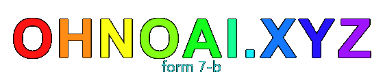
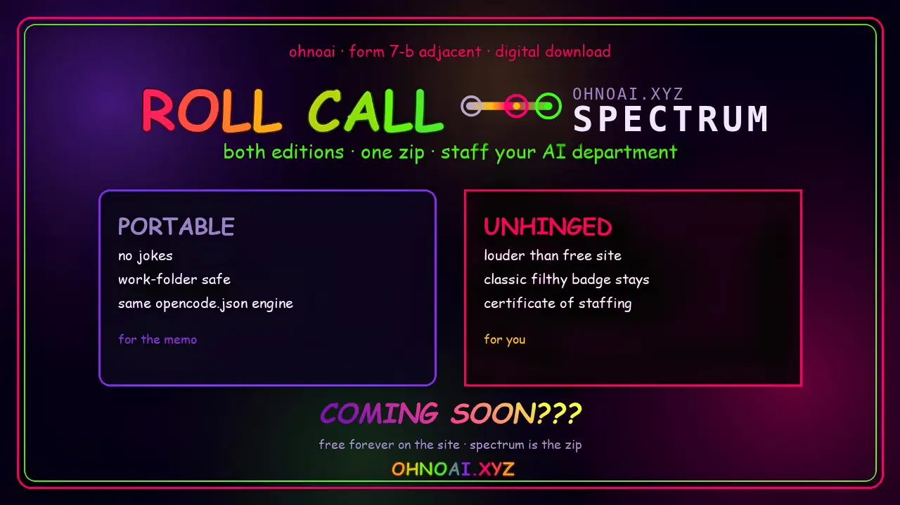

[](https://ohnoai.xyz)

# Roll Call

Assign OpenCode Zen/Go models to agent roles and generate the `agent` block of an `opencode.json`.

Filthy human form (loud, Form 7-B compliant. The non-existant board wasn't *actually* available for approval, so I used a ouija board instead. Spirits said 'ok'). Machine edition: `agent.md` + `cli.mjs`.

**Status: free forever on the public site.** This repo isolates the tool so it can live as its own little trash heap.

| Home | Role |
| ------ | ------ |
| **This repo** | Source isolation, local/CLI use, optional own deploy |
| **[ohnoai.xyz/tools/roll-call/](https://ohnoai.xyz/tools/roll-call/)** | Live free host (canonical public URL) |
| **[ohnoai.dev](https://ohnoai.dev)** | Sister site (hire-me surface) |

## What's in here

```
index.html          # human UI (jokes intact)
cli.mjs             # zero-dep Node 18+ generator
agent.md            # machine-facing spec
api/models/zen.js   # CORS proxy for OpenCode Zen catalog
api/models/go.js    # CORS proxy for OpenCode Go catalog
vercel.json         # optional Vercel deploy for UI + proxies
```

## Quick use

**CLI (no UI):**

```bash
curl -o roll-call-cli.mjs https://ohnoai.xyz/tools/roll-call/cli.mjs
node roll-call-cli.mjs roles.json > opencode.json
```

Or from a clone of this repo:

```bash
node cli.mjs roles.json > opencode.json
node cli.mjs --help
```

**Local UI:**

```bash
# needs the /api/models/* proxies for live catalogs (Vercel), or open index.html
# and accept the fallback list if proxies aren't running
npx --yes serve .
# then open /  (and /api/models/zen if deployed with Vercel functions)
```

**Agent handoff:** point an agent at `agent.md` (or the live copy at  
<https://ohnoai.xyz/tools/roll-call/agent.md>).

## Relationship to ohnoai.xyz

- The site still ships the tool under `/tools/roll-call/` with the same personality.
- Site chrome (home / brain spam / tools) links from this isolated copy point at **absolute** `https://ohnoai.xyz/...` URLs so the branding still works off-site.

### Spectrum (paid zip · link pending)

[](https://ohnoai.xyz/spectrum/)

## License

MIT - see [LICENSE](LICENSE).
